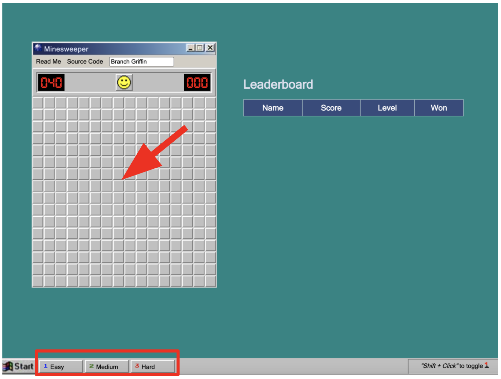
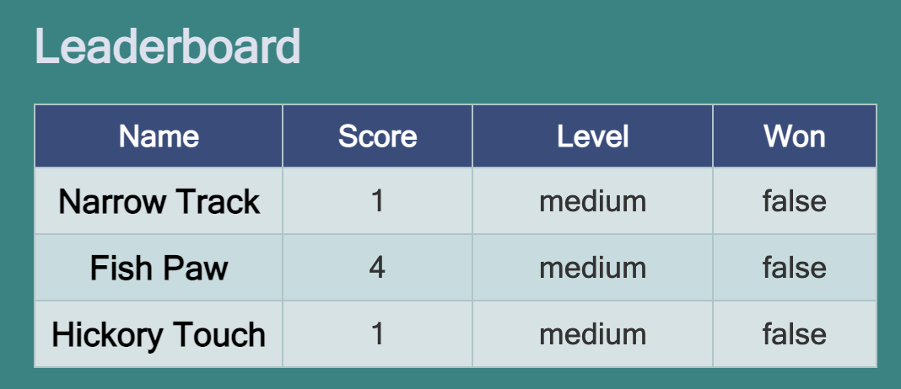
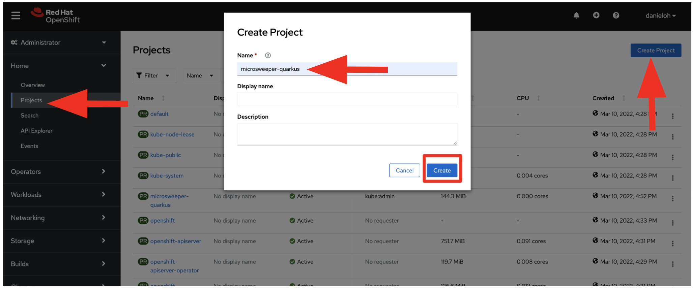
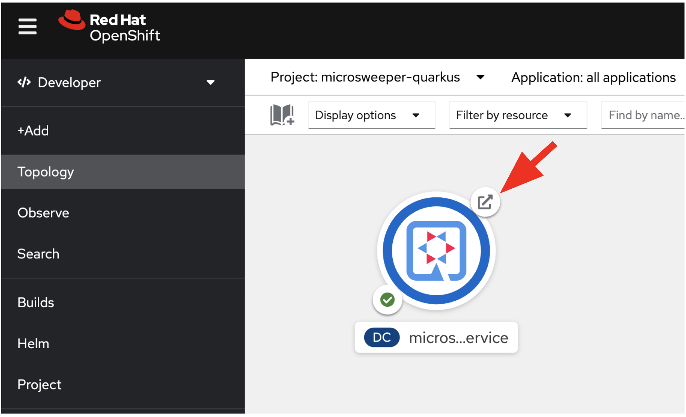
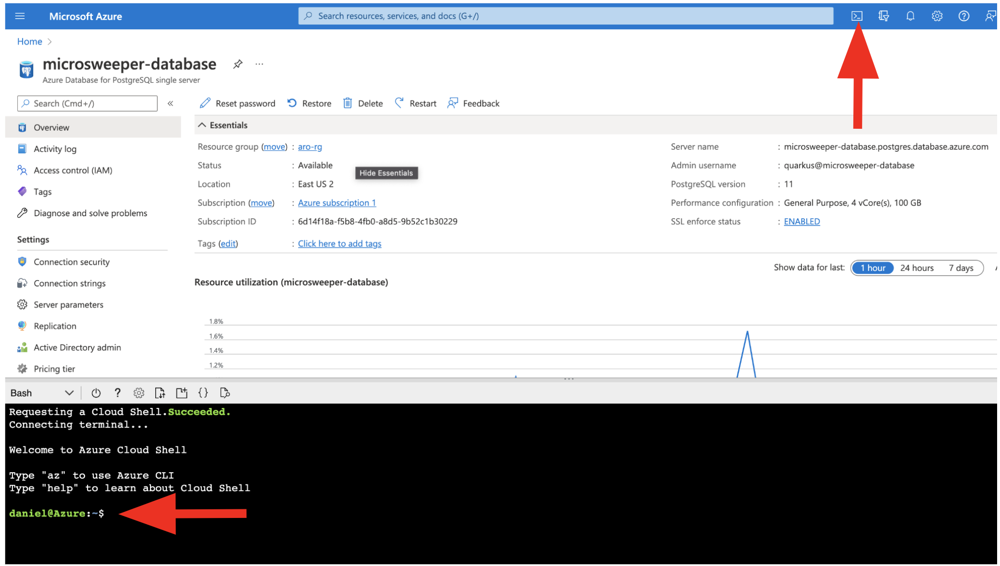
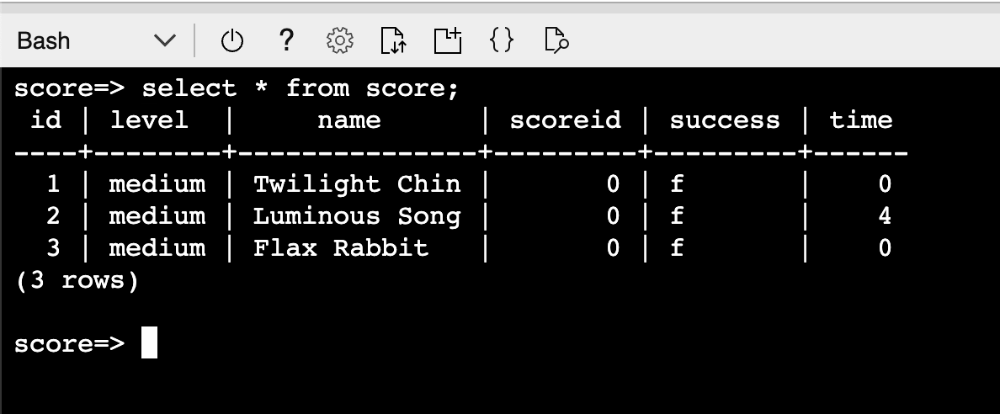
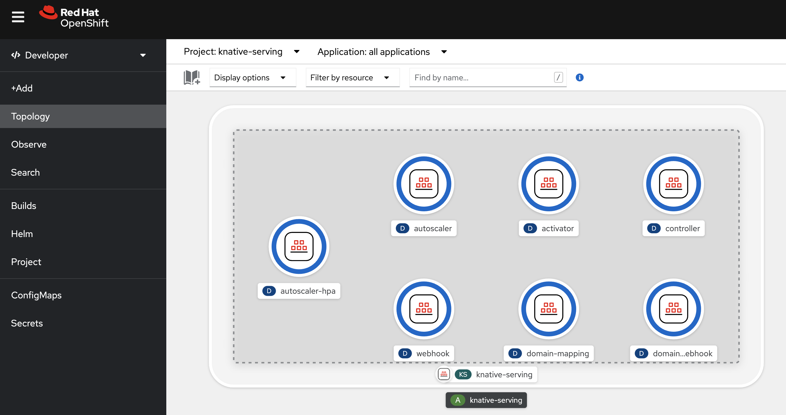
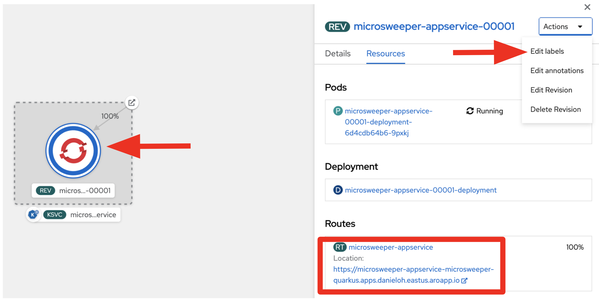
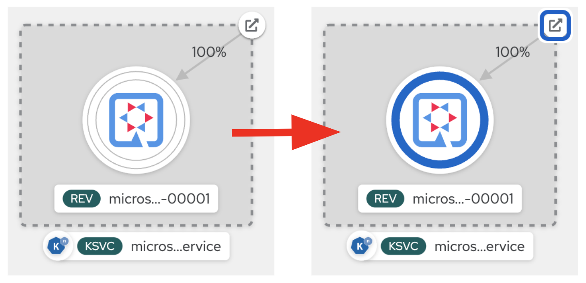
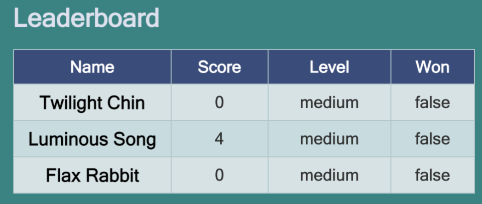

# Red Hat Microsweeper Demo with Quarkus on Red Hat OpenShift Service on AWS (ROSA)

This demo uses a number of cloud technologies to implement a simple game from the earlier days of computing: Minesweeper!

Watch the demo video that walks you through the instructions step by step:

[](https://youtu.be/zYSQdX-tVsE "Microsweeper Demo with Quarkus on  Red Hat OpenShift Service on AWS")

# Table of Contents

1. [Test your Quarkus App Locally](#TestApplicationLocally)
2. [Deploy the Quarkus App to  Red Hat OpenShift Service on AWS (ARO)](#DeployQuarkusApp)
3. [Evolve Serverless Functions with Quarkus on  Red Hat OpenShift Service on AWS](#DeployServerlessFunction)


Technologies include:

* JQuery-based Minesweeper written by [Nick Arocho](http://www.nickarocho.com/) and [available on GitHub](https://github.com/nickarocho/minesweeper).
* Backend based on [Quarkus](https://quarkus.io) to persist scoreboard and provide a reactive frontend and backend connected to [Postgres](https://azure.microsoft.com/en-us/services/postgresql/).
* Application Deployment on [ Red Hat OpenShift Service on AWS (ARO)](https://azure.microsoft.com/en-us/services/openshift/)
* Datastore to store scores on [Azure Database for PostgreSQL](https://azure.microsoft.com/en-us/services/postgresql/) 

## 1. Test your Quarkus App Locally<a name="TestApplicationLocally"></a>

Quarkus supports the automatic provisioning of unconfigured services in development and test mode. We refer to this capability as [Dev Services](https://quarkus.io/guides/dev-services#databases). From a developer’s perspective this means that if you include an extension and don’t configure it then Quarkus will automatically start the relevant service (usually using _Testcontainers_ behind the scenes) and wire up your application to use this service. 

**quarkus:dev** runs Quarkus in development mode. This enables live reload with background compilation, which means that when you modify your Java files and/or your resource files and refresh your browser, these changes will automatically take effect. This works too for resource files like the configuration property file. Refreshing the browser triggers a scan of the workspace, and if any changes are detected, the Java files are recompiled and the application is redeployed; your request is then serviced by the redeployed application. If there are any issues with compilation or deployment an error page will let you know.

This will also listen for a debugger on port 5005. If you want to wait for the debugger to attach before running you can pass _-Dsuspend_ on the command line. If you don’t want the debugger at all you can use _-Ddebug=false_.

Quarkus also provides a command-line tool (CLI) for developers to create projects, manage extensions and do essential build and dev commands using the underlying project build tool. Find the installation document [here](https://quarkus.io/guides/cli-tooling).

Run the following command line to start Quarkus dev mode. It will automatically start a PostgreSQL container on your local container runtime (e.g. Docker or [Podman](https://podman.io/)):


```
$ quarkus dev
```

_Note_ that you can also use _Maven_ command-line tool (_mvn quarkus:dev_).

The output should look like:

```
__  ____  __  _____   ___  __ ____  ______ 
 --/ __ \/ / / / _ | / _ \/ //_/ / / / __/ 
 -/ /_/ / /_/ / __ |/ , _/ ,< / /_/ /\ \   
--\___\_\____/_/ |_/_/|_/_/|_|\____/___/   
[org.hib.eng.jdb.spi.SqlExceptionHelper] (JPA Startup Thread: <default>) SQL Warning Code: 0, SQLState: 00000

...

INFO  [io.quarkus] (Quarkus Main Thread) microsweeper-appservice 1.0.0-SNAPSHOT on JVM (powered by Quarkus 2.7.4.Final) started in 9.631s. Listening on: http://localhost:8080
INFO  [io.quarkus] (Quarkus Main Thread) Profile dev activated. Live Coding activated.
INFO  [io.quarkus] (Quarkus Main Thread) Installed features: [agroal, cdi, hibernate-orm, hibernate-orm-panache, jdbc-postgresql, micrometer, narayana-jta, resteasy-reactive, resteasy-reactive-jsonb, smallrye-context-propagation, vertx]

--
Tests paused
Press [r] to resume testing, [o] Toggle test output, [:] for the terminal, [h] for more options>
```

Press `w` key on the terminal where Quarkus dev mode is running. Then, it will automatically open a web browser or tab window to show the **Microsweeper** application. 
_Note_ that you can also access the application GUI at http://localhost:8080 directly



Try playing the mine game! Then you will *scores* in the _Leaderboard_:



Access the RESTful API (_/api/score_) to get all scores that store in the local PostgreSQL database. Run the following API testing client [HTTPie](https://httpie.io/) command-line tool: 

```
$ http :8080/api/scoreboard
```

The output should look like:

```
HTTP/1.1 200 OK
Content-Type: application/json
content-length: 253

[
    {
        "id": 1,
        "level": "medium",
        "name": "Narrow Track",
        "scoreId": 0,
        "success": false,
        "time": 1
    },
    {
        "id": 2,
        "level": "medium",
        "name": "Fish Paw",
        "scoreId": 0,
        "success": false,
        "time": 4
    },
    {
        "id": 3,
        "level": "medium",
        "name": "Hickory Touch",
        "scoreId": 0,
        "success": false,
        "time": 1
    }
]
```

Note that you can use `curl` command-line tool to access the RESTful API by `curl localhost:8080/api/scoreboard`.

## 2. Deploy the Quarkus App to  Red Hat OpenShift Service on AWS (ARO)<a name="DeployQuarkusApp"></a>

 Red Hat OpenShift Service on AWS provides highly available, fully managed OpenShift clusters on demand, monitored and operated jointly by Microsoft and Red Hat. Kubernetes is at the core of Red Hat OpenShift. OpenShift brings added-value features to complement Kubernetes, making it a turnkey container platform as a service (PaaS) with a significantly improved developer and operator experience. If you haven't installed ARO cluster with your own Azure account, take a moment to follow up on the below documents: 

* [Tutorial: Create an additional Azure subscription](https://docs.microsoft.com/en-us/azure/cost-management-billing/manage/create-subscription)
* [How to install the Azure CLI](https://docs.microsoft.com/en-us/cli/azure/install-azure-cli)
* [Create an  Red Hat OpenShift Service on AWS 4 cluster](https://docs.microsoft.com/en-us/azure/openshift/tutorial-create-cluster)

_Note_ that  Red Hat OpenShift Service on AWS requires a minimum of `40` cores to create and run an OpenShift cluster. The default Azure resource quota for a new Azure subscription does not meet this requirement.

### Create an Azure Database for PostgreSQL

Let's say that ARO is our production environment to deploy the Microsweeper application. Also, We need to guarantee _data persistency_ regardless of randomly restarting an application container (_Microsweeper_) on the Kubernetes cluster. 

**Azure Database for PostgreSQL** is a managed service to run, manage, and scale highly available PostgreSQL databases in the Azure cloud. The following quickstart shows you how to create a single Azure Database for PostgreSQL server and connect to it.

[Quickstart: Create an Azure Database for PostgreSQL server by using the Azure portal](https://docs.microsoft.com/en-us/azure/postgresql/quickstart-create-server-database-portal)

Note that be sure to key the following value in the setting:

* Server name - `microsweeper-database`
* Admin username - `quarkus`
* Password - `r3dh4t1!`


### Create a **score** database in PostgreSQL

The PostgreSQL server that you created earlier is empty. It doesn't have any database that you can use with the Quarkus application. Create a new database called `score` by using the following command:

```shell
az postgres db create \
  --resource-group $RESOURCE_GROUP \
  --name score \
  --server-name microsweeper-database
```

### Deploy a Quarkus App to ARO<a name="DeployQuarkusApp"></a>

Go to `All resources` in Azure portal. Then, click on `OpenShift Cluster` resource:


To access `OpenShift Web Console`, click on `OpenShift Console URL`.

After you log in to the OpenShift console using `kubeadmin` or your own user account, create a new project (_microsweeper-quarkus_): 

* [Tutorial: Connect to an  Red Hat OpenShift Service on AWS 4 cluster](https://docs.microsoft.com/en-us/azure/openshift/tutorial-connect-cluster)

* Name: microsweeper-quarkus



Quarkus also offers the ability to automatically generate OpenShift resources based on sane default and user supplied configuration. The OpenShift extension is actually a wrapper extension that brings together the [kubernetes](https://quarkus.io/guides/deploying-to-kubernetes) and [container-image-s2i](https://quarkus.io/guides/container-image#s2i) extensions with defaults so that it’s easier for the user to get started with Quarkus on OpenShift.

Add `quarkus-openshift` extension in Terminal:

```
$ quarkus ext add openshift
```

The output should look like:

```
[SUCCESS] ✅  Extension io.quarkus:quarkus-openshift has been installed
```

Quarkus supports the notion of configuration profiles. These allows you to have multiple configurations in the same file and select between then via a profile name.

By default Quarkus has three profiles, although it is possible to use as many as you like. The default profiles are:

* **dev** - Activated when in development mode (i.e. _quarkus:dev_)
* **test** - Activated when running tests
* **prod** - The default profile when not running in development or test mode

Let’s uncomment the following variables in `src/main/resources/application.properties`:

```
# Database configurations
%prod.quarkus.datasource.db-kind=postgresql
%prod.quarkus.datasource.jdbc.url=jdbc:postgresql://microsweeper-database.postgres.database.azure.com:5432/score
%prod.quarkus.datasource.jdbc.driver=org.postgresql.Driver
%prod.quarkus.datasource.username=quarkus@microsweeper-database
%prod.quarkus.datasource.password=r3dh4t1!
%prod.quarkus.hibernate-orm.database.generation=drop-and-create

# OpenShift configurations
%prod.quarkus.kubernetes-client.trust-certs=true
%prod.quarkus.kubernetes.deploy=true
%prod.quarkus.kubernetes.deployment-target=openshift
%prod.quarkus.openshift.build-strategy=docker
%prod.quarkus.openshift.expose=true
```

Before deploying the app to AZO, be sure to log in to the right project (_microsweeper-quarkus_) via `oc` command-line tool.

* [Installing the OpenShift CLI](https://docs.openshift.com/container-platform/4.10/cli_reference/openshift_cli/getting-started-cli.html)

Get the token from OpenShift web consol. Then, paste the `oc login` command-line with the _token_ in Terminal.


The output should look like:

```
Logged into "https://api.danieloh.eastus.aroapp.io:6443" as "YOUR-USERNAME" using the token provided.

You have access to 68 projects, the list has been suppressed. You can list all projects with 'oc projects'

Using project "microsweeper-quarkus".
```

Now let’s deploy the application itself. Run the following Quarkus CLI which will build and deploy using the OpenShift extension:

```
$ quarkus build --no-tests
```

The output should end with `BUILD SUCCESS`.

Finally, make sure it’s actually done rolling out:

```
$ oc rollout status -w dc/microsweeper-appservice
```

Wait for that command to report `replication controller microsweeper-appservice-1 successfully rolled out` before continuing.

Go to the `Topology View` in _OpenShift Dev Perspective_, make sure it’s done deploying (dark blue circle):



Click on the Route icon above (the arrow) to access the **Microsweeper** running on ARO. Then, give it try to play the mine game a few time:


Access the RESTful API (_/api/score_) to get all scores that store in the **Azure PostgreSQL database**. You need to replace with your own `ROUTE` url: 

```
$ http http://YOUR-ROUTE-URL/api/scoreboard
```

The output should look like:

```
[
    {
        "id": 1,
        "level": "medium",
        "name": "Twilight Chin",
        "scoreId": 0,
        "success": false,
        "time": 0
    },
    {
        "id": 2,
        "level": "medium",
        "name": "Luminous Song",
        "scoreId": 0,
        "success": false,
        "time": 4
    },
    {
        "id": 3,
        "level": "medium",
        "name": "Flax Rabbit",
        "scoreId": 0,
        "success": false,
        "time": 0
    }
]
```

### Connect to the Azure PostgreSQL server using Azure Cloud Shell

Open Azure Cloud Shell in the Azure portal by selecting the icon on the upper-left side:



Run the following command in the Azure Cloud Shell terminal. Replace values with `your server name` and admin user login name:

```
psql --host=YOUR-POSTGRESQL-SERVER-NAME --port=5432 --username=quarkus@microsweeper-database --dbname=score
```

Key the password (`r3dh4t1!`) in the prompt. Then, execute the following query to get all scores:

```
select * from score;
```

The output should be the **same** as the above _Leaderboard_ GUI:



**Great job!** You've successfully deployed the Quarkus app to ARO with connecting to Azure PostgreSQL server.

## 3. Evolve Serverless Functions with Quarkus on  Red Hat OpenShift Service on AWS<a name="DeployServerlessFunction"></a>

Quarkus provides **Funqy** extensions to create a portable Java API for deployable functions in multiple serverless platforms such as OpenShift Serverless (Knative), AWS Lambda, Azure Functions, Google Cloud Functions. The main difference between Quarkus functions on ARO and direct Azure Functions is that you can build and deploy a native executable as the serverless function for faster cold starts and tiny memory footprints.

If you haven't installed the OpenShift Serverless ane Knative Serving CR yet, find more information as below:

* [Installing the OpenShift Serverless Operator](https://docs.openshift.com/container-platform/4.10/serverless/install/install-serverless-operator.html)
* [Installing Knative Serving](https://docs.openshift.com/container-platform/4.10/serverless/install/installing-knative-serving.html)

You should see the deployed pods when you have successfully installed the OpenShift Serverless:



**Update** the following values in `src/main/resources/application.properties` to keep the existing score data and deploy the application as the serverless function:

```
%prod.quarkus.hibernate-orm.database.generation=update
%prod.quarkus.kubernetes.deployment-target=knative
```

**Uncomment** the following variables in `src/main/resources/application.properties`:

```
%prod.quarkus.container-image.group=microsweeper-quarkus
%prod.quarkus.container-image.registry=image-registry.openshift-image-registry.svc:5000
```

_Note_ that if you want to build a native executables on `macOS`, add the following configuration to use Linux binary file format:

```
%prod.quarkus.native.container-build=true
```

Before the build, delete existing `microsweeper` application by the following `oc` command:

```
oc delete all --all
```

Build the native executables then deploy it to ARO. Run the following Quarkus CLI which will build and deploy using the OpenShift extension:

```
$ quarkus build --no-tests --native
```

The output should end with `BUILD SUCCESS`.

Go back to the _Topology_ view, edit labels to add Quarkus icon. Click on microsweeper **REV** then select **Edit Labels** in _Actions_ drop box:



Add this label and click on `Save`:

```
app.openshift.io/runtime=quarkus
```

The pod might scale down to `zero` if you didn't send traffic in `30` seconds. Let's access the Microsweeper game by clicking on the `Open URL` link. It triggers knative to spin up the pod again automatically, and will shut it down 30 seconds later:



You will see the same scores in the Leaderboard as the above scores because the Azure PostgreSQL database is running on Azure cloud:



### (Optional) Delete  Red Hat OpenShift Service on AWS cluster

In case you need to delete ARO for the cost saving after the demo, follow up on this tutorial:

* [Tutorial: Delete an  Red Hat OpenShift Service on AWS 4 cluster](https://docs.microsoft.com/en-us/azure/openshift/tutorial-delete-cluster)